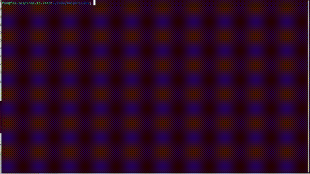

# 自制大模型推理框架
> 带你从零写一个支持LLama推理，支持Cuda加速的大模型框架

**🙋🙋🙋 自制大模型推理框架火热进行中，只要178块，请加下方微信了解**


## 项目运行效果
> LLama1.1b fp32模型，视频无加速，运行平台为Nvidia 3060 laptop



## 课程目录
只要178块，只要178块，只要178块！重要的事情说三遍！！！

**一、项目整体架构和设计**
> 学习架构思维，防止自己只会优化局部实现

1. 环境的安装和课程简介
2. 资源管理和内存管理类的设计与实现
3. 张量类的设计与实现
4. 算子类的设计与实现
5. 算子的注册和管理

**二、补齐算法工程师思维**
> 在算法层面讲解大模型和Transformer的原理之后，开始对LLama2进行支持

6. LLama模型的分析
7. MMap内存映射技术打开大模型的权重文件
8. LLama模型文件的参数和权重载入 
9. LLama中各个层的初始化以及输入张量、权重张量的分配和申请
10. 实现大模型中的KV Cache机制

**三、模型的量化**
> 为了减少显存的占用，我们开发了int8模型量化模块
11. 量化模型权重的导出
12. 量化系数和权重的加载
13. 量化乘法算子的实现

**四、Cuda基础和算子实现**
> 带你学Cuda并在实战大模型算子的实现，为大模型推理赋能
14. Cuda基础入门1 - 内容待定
15. Cuda基础入门2 - 内容待定
16. Cuda基础入门3 - 内容待定
17. Cuda基础入门4 - 内容待定
18. RMSNorm算子的Cuda实现
19. Softmax算子的Cuda实现 
20. Add算子的Cuda实现 
21. Swiglu算子的Cuda实现 
22. GEMV算子的Cuda实现 
23. 多头注意力机制的Cuda实现 
24. 让框架增加Cuda设备的支持和管理 
25. 完成Cuda推理流程

**五、用推理框架做点有趣的事情**

26. 文本生成
27. 讲一段小故事
28. 让大模型和你进行多轮对话


**六、学习其他商用推理框架的实现，查漏补缺**

29. LLama.cpp的设计和实现讲解

    *这里有多个小节*
30. Miopen（AMD出品，对标CUDNN）的设计和实现讲解

    *这里有多个小节*
32. 总结


## 第三方依赖
1. google glog https://github.com/google/glog
2. google gtest https://github.com/google/googletest
3. sentencepiece https://github.com/google/sentencepiece
4. armadillo + openblas https://arma.sourceforge.net/download.html
5. Cuda Toolkit

**openblas作为armadillo的后端数学库，加速矩阵乘法等操作，也可以选用Intel-MKL，这个库用于CPU上的推理计算**


## 模型下载地址
1. llama2 https://pan.baidu.com/s/1PF5KqvIvNFR8yDIY1HmTYA?pwd=ma8r 或 https://huggingface.co/fushenshen/lession_model/tree/main

2. Tiny LLama 
* tinyllama模型 https://huggingface.co/karpathy/tinyllamas/tree/main
* tinyllama分词器 https://huggingface.co/yahma/llama-7b-hf/blob/main/tokenizer.model

## 模型导出
```shell
python export.py llama2_7b.bin --meta-llama path/to/llama/model/7B
# 使用--hf标签从hugging face中加载模型， 指定--version3可以导出量化模型
# 其他使用方法请看export.py中的命令行参数实例
```


## 编译方法
```shell
  # 假设已经装好上述的第三方依赖
  mkdir build 
  cd build
  cmake ..
  make -j16
```

## 生成文本的方法
```shell
./llama_infer llama2_7b.bin tokenizer.model

```
